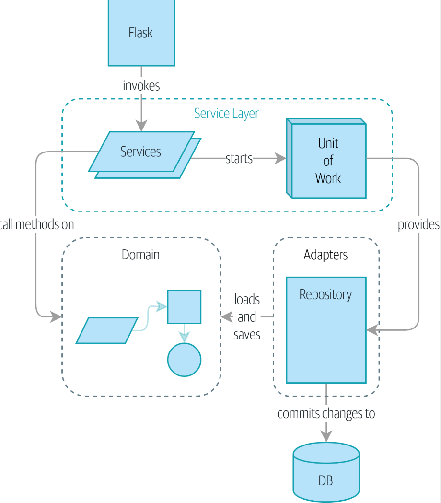

## Architecture Patterns with Python

[도서 링크](https://www.yes24.com/Product/Goods/101818336)

파이썬을 활용한 아키텍쳐 패턴을 FastAPI로 구현

## Part 1. 도메인 모델링을 지원하는 아키텍처 구축

### 핵심 내용
- 저장소 패턴(repository pattern)
- 서비스 계층 패턴(service layer pattern)
- 작업 단위 패턴(unit of work)
- 애그리게이드 패턴(aggregate-pattern)


### 목표



- 높은 수준의 테스트를 통해 검증된 도메인 모델을 만드는 방법을 숙지
- DB와 API등 시스템 하부 구조를 분리
- 의존성 역전 원칙을 적용
- 포트와 어뎁터에서 영감을 얻은 저장소나 작업 단위 패턴을 사용 -> TDD를 높은 기어비, 낮은 기어비로 양쪽에서 수행
- 엔드투엔드 테스트와 통합 테스트의 최소화
- 일관성 경계 개념


### Chapter 1. Domain Modeling
- 도메인 모델?
  - 도메인 : 해결하기 위해 주어진 문제(가구 판매, 쇼핑몰, 등..), 비지니스 프로세스는 이러한 도메인문제를 해결하는 과정을 의미한다.
  - 모델 : 비지니스의 구성 요소, 추상화 된 비지니스의 흐름, 우리가 머리속에서 그리는 현상에 대한 설명 
- 도메인 노트
  - 여러 역할을 가진 사람들이 서로 도메인에 대해 통일된 전문용어(유비쿼터스)를 가지고 제약조건이나 프로세스를 정리한 노트
  - 다음은 도메인 노트의 예시이다.
```
제품은 SKU로 식별된다. sku는 재고 유지 단위 (stock keeping unit)의 약자다, 고객은 주문을 넣는다. 
주문은 주문 참조 번호에 의해 식별되어 한 줄의 주문 리인(order line)을 포합한다. 각 주문 라인에는 SKU와 수량이 있다. 
애를 들면 다음과 같다.
* RED-CHAIR 10단위
* TASTELESS-LAMP 1 단위

구매 부서는 재고를 작은 배치로 주문한다. 재고 배치는 유일한 ID(참조 번호라고 부름), SKU, 수량으로 이루어진다.
배치에 주문 라인을 할당해야 한다. 주문 라인을 배치에 할당하면 해당 배치에 속하는 재고를 고객의 주소로 배송한다.
어떤 배치의 재고를 주문 라인에 x단위로 할당하면 가용 재고 수량은 x 만큼 줄어든다.
예를 들면 다음과 같다.
* 20단위의 SMALL-TABLE로 이루어진 배치가 있고, 2단위의 SMALL-TABLE을 요구하는 주문 라인이 있다.
* 주문 라인을 할당하면 배치에 18단위의 SMALL-TABLE이| 남아야 한다.

배치의 가용 재고 수량이 주문 라인의 수량보다 작으면 이 주문 라인을 배치에 할당할 수 없다.
예를 들면 다음과 같다.
* 1단위의 BLUE-CUSHION이라는 배치가 있고, 2단위 BLUE-CUSHION에 대한 주문 라인이 있다.
* 이 주문 라인을 이 배치에 할당해서는 안 된다.

같은 주문 라인을 두 번 이상 할당해서는 안 된다. 예를 들면 다음과 같다.
* 10단위의 BLUE-VASE이라는 배치가 있고, 2단위 BLUE-VASE 주문 라인을 이 배치에 할당한다.
* 같은 주문 라인을 다시 같은 배치에 할당해도 배치의 가용 재고 수량은 계속 8개를 유지해야 한다.

배지가 현재 배송 중이면 ETA 정보가 배치에 들어있다. ETA가 없는 배치는 창고 재고다. 창고 재고를 배송 중인 배치보다 더 먼저 할당해야 한다.
배송 중인 배치를 할당할 때는 ETA가 가장 빠른 배치를 먼저 할당한다.

```

- 엔티티 vs 값객체

엔티티와 값 객체를 구분하기 위해서는 둘을 어떻게 구분할지, 구분 단위에 대해 이해해야한다.
  일반적으로 엔티티는 클래스로 부터 생성된 인스턴스 혹은 부여 받은 식별자(id, ref)로 구분할 수 있다.
  따라서, 내부의 값이 변화해도 부여된 식별자 혹은 만들어진 인스턴스 객체가 동일하다면 정체성 동등성에 따라 동일한 엔티티로 인식해야한다.

  </br>
  반면, 돈이나, 크기, 길이와 같이 상대적인 개념은 인스턴스 혹은 식별자로 구분하는 것이 의미를 갖지 않는다. 
  이 처럼 값 객체는 식별자가 아닌 내부에 들어있는 값에 따라 의미를 갖기 때문에 `@dataclass`를 통해 불변객체로 만든다.

```python
@dataclass(frozen=True)
class Money: # 값 객체
    currency : str
    value : int

class Batch:
    def __init__(self, ref: str, sku: str, qty: int, eta: Optional[date]):
        self.reference = ref
        self.sku = sku
        self.eta = eta
        self._purchased_quantity = qty
        self._allocations = set()  # type: Set[OrderLine]
```

- 도메인 서비스의 개념  
  Batch 모델은 도메인에서 정의된 작업을 수행할 수 있지만, 모델 내에서 표현할 수 없는 기능을
  `도메인 서비스 함수(연산)`라고 정의한다. 1장에서의 예시에선 주문 라인을 적절한 배치에 할당하는 연산은 주문라인 모델에서도 배치 모델에서도 정의하기 힘들다.  
  따라서 이를 도메인 서비스 함수로 만들어 구현하게 되었다.

- 추가 문법
  - @property : 함수를 attribute 처럼 사용할 수 있다.
    ```python
    class Batch:
    
        @property
            def allocated_quantity(self) -> int:
    ```
  - @dataclass : 특정 class를 값객체로 만든다.

    ```python
    @dataclass(frozen=True)
    class OrderLine:
        ref: str
        sku: str
        qty: int
    ```
    
    - next(), sorted(), `__gt__()`
        - next() : iterator를 순회하며 값을 차례로 꺼냄 더이상 값이 없다면 `StopIteration`을 
        - sorted() : iterator를 정렬 `__gt__()`를 정의해야한다  
        - `__gt__()` : 값을 비교, x > y 를 판단

    ```python
        class Batch:
            ...
            def __gt__(self, other):
                if self.eta is None:
                    return False
        
                if other.eta is None:
                    return True
                return self.eta > other.eta
        
        
            def allocate(line: OrderLine, batches: List[Batch]) -> str:
                try:
                    batch = next(
                        b for b in sorted(batches) if b.can_allocate(line)
                    )
                    batch.allocate(line)
                    return batch.reference
                except StopIteration:
                    raise OutOfStock(f"Out of stock for sku : {line.sku}")

    ```